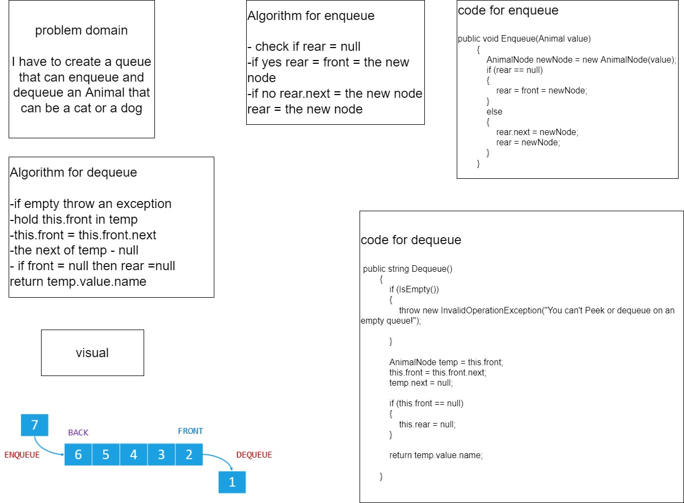

# Challenge Summary

I have to create a queue that can enqueue and dequeue an Animal that can be a cat or a dog

## Whiteboard Process

## Approach & Efficiency
time complexity for enqueue = O(1)

time complexity for dequeue = O(1)

space complexity for enqueue = O(1)

space complexity for dequeue = O(1)

