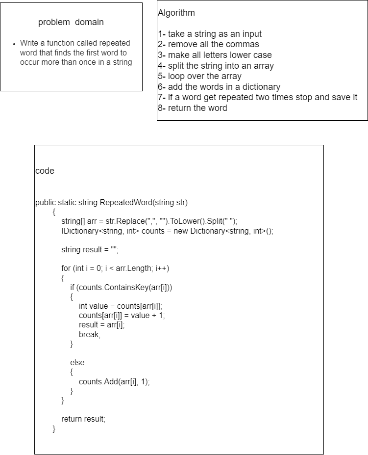


# Challenge Summary

Write a function called repeated word that finds the first word to occur more than once in a string

## Whiteboard Process

## Approach & Efficiency

time complexity O(n)
space complexity O(n)

## Solution

