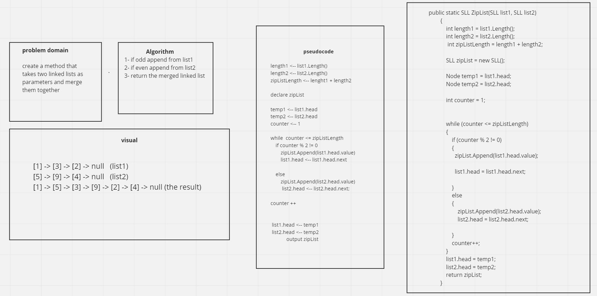

# challenge 8

## Problem domain
create a method that takes two linked lists as parameters and mrege them together 

### Methods for challenge 8

ZipList

### tests for challenge 8

ZipList: it tests if the two linked lists has mereged in the required way.

### Approach & Efficiency for Challenge 8

ZipList  space = O(n)

ZipList  time = O(n)

### API for Challenge 7

ZipList: a method that takes two linked lists as parameters and mrege them together 

